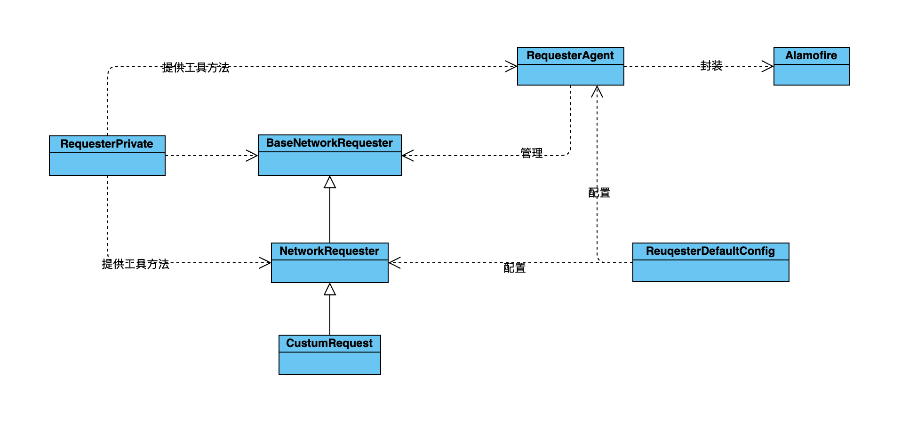

# NetworkRequester
Swift版本YTKNetwork。

# 环境及版本要求
- Alamofire5.0.0以上版本
- swift5.0以上版本

---

# 功能

那么该库在Alamofire的基础上添加了哪些功能：

- 支持按时间缓存网络请求内容
- 支持按版本号缓存网络请求内容
- 支持统一设置服务器和 CDN 的地址
- 支持检查返回 JSON 内容的合法性
- 支持文件的断点续传
- 支持```闭包```和```delegate```两种模式的回调方式
- 支持批量的网络请求发送，并统一设置它们的回调(实现在```BatchRequest```类中)
- 支持方便地设置有相互依赖的网络请求的发送，例如：发送请求 A，根据请求 A 的结果，选择性的发送请求 B 和 C，再根据 B 和 C 的结果，选择性的发送请求 D。（实现在 ChainRequest 类中）
- 支持网络请求 URL 的 filter，可以统一为网络请求加上一些参数，或者修改一些路径。

# 应用场景

如果你的项目中需要缓存网络请求、管理多个网络请求之间的依赖、希望检查服务器返回的 JSON 是否合法，那么 NetworkRequester 能给你带来很大的帮助。如果你缓存的网络请求内容需要依赖特定版本号过期，那么 NetworkRequester 就能发挥出它最大的优势。

# 基本思想

NetworkRequester 的基本的思想是把每一个网络请求封装成对象。所以使用 YTKNetwork，你的每一个请求都需要继承 NetworkRequester 类，通过覆盖父类的一些方法来构造指定的网络请求。

把每一个网络请求封装成对象其实是使用了设计模式中的 Command 模式，它有以下好处：

- 将网络请求与具体的第三方库依赖隔离，方便以后更换底层的网络库。
- 方便在基类中处理公共逻辑。
- 方便在基类中处理缓存逻辑，以及其它一些公共逻辑。
- 方便做对象的持久化。

但是如果你的工程非常简单，这么写会显得没有直接用 Alamofire 将请求逻辑写在 Controller 中方便，所以 NetworkRequester 并不适合特别简单的项目。

# 各模块功能介绍

类名|功能
-|-
BaseNetworkRequester|定义子类需覆盖的自定义参数方法及对应的默认参数
NetworkRequester|BaseNetworkRequester的子类。负责缓存的处理：请求前查询缓存；请求后写入缓存。所有的网络请求类需要继承于该类,每一个NetworkRequester类的子类代表一种专门的网络请求
RequesterUtils|工具类，处理一些加密、验证、序列化等工作
RequesterDefaultConfig|负责所有请求的全局配置，例如baseUrl和CDNUrl等等
RequesterAgent|该类为单例，负责管理所有的请求类（例如CustomRequest）。当CustomRequest发送请求以后，会把自己放在RequesterAgent持有的一个字典里，让其管理自己。实际上是RequesterAgent封装了Alamofire，由它负责Alamofire请求的发送和Alamofire的回调处理。如果我们需要第三方网络请求库，就可以在这里更换一下。而NetworkRequester更多的是只是负责缓存的处理。
BatchRequest|可以发起批量请求，持有一个数组来保存所有的请求类。在请求执行后遍历这个数组来发起请求，如果其中有一个请求返回失败，则认定本组请求失败。
BatchRequestAgent|负责管理多个BatchRequest实例，持有一个数组来保存BatchRequest。支持添加和删除BatchRequest实例。
ChainRequest|可以发起链式请求，持有一个数组来保存所有的请求类。当某个请求结束后才能发起下一个请求，如果其中有一个请求返回失败，则认定本请求链失败。
ChainRequestAgent|负责管理多个ChainRequestAgent实例，持有一个数组来保存ChainRequest。支持添加和删除ChainRequest实例。

# 结构图



其他使用方法可参照: https://github.com/yuantiku/YTKNetwork/blob/master/Docs/README_cn.md
